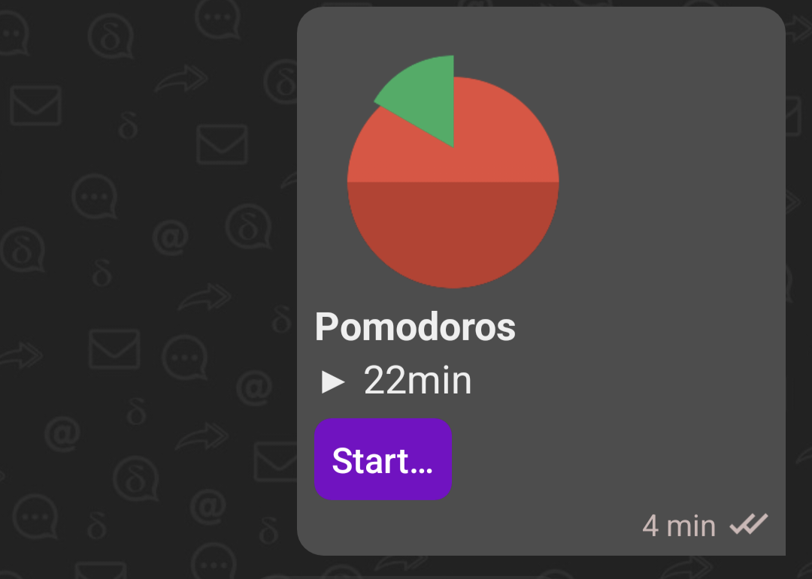
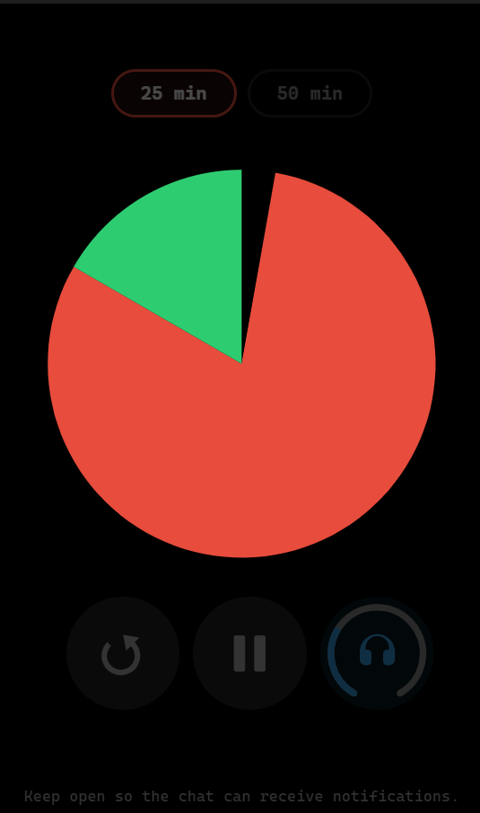
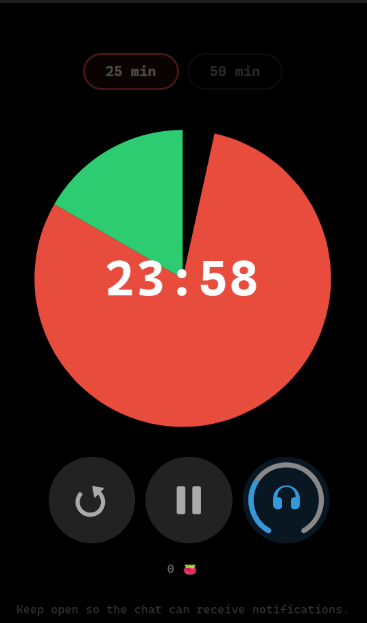

# Pomodoros

Shared pomodoro timer for [Delta Chat](https://delta.chat), built as a [webxdc](https://webxdc.org) app.

Two-phase focus + break timer with pie chart visualization. Choose 25 or 50 minute sessions. Tap the pie to reveal remaining time. Chat members are notified when time is up.

Multilingual symbol-based UI — no text labels to translate.

## Screenshots

Chat preview with live timer status:



Idle, ready to start a 25 or 50 minute session:



Tap the pie to reveal remaining time:



## Install

Download `pomodoros.xdc` from the [latest release](https://github.com/maphouse/pomodoros/releases/latest) and send it as a file in any Delta Chat conversation.

## Development

Requires [webxdc-dev](https://github.com/niclas/webxdc-dev) for local testing.

```bash
npx webxdc-dev app/
```

Package for Delta Chat:

```bash
(cd app/ && zip -9 --recurse-paths - *) > pomodoros.xdc
```
